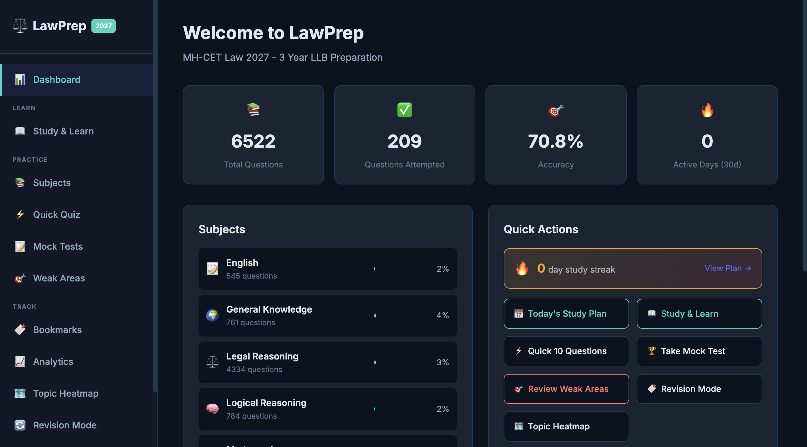
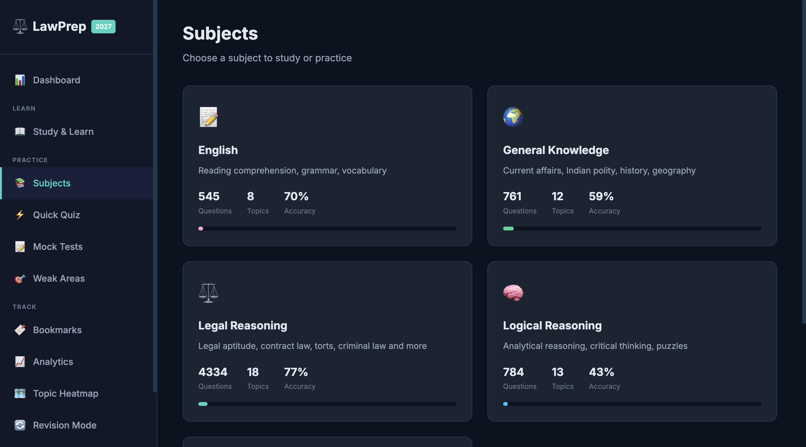
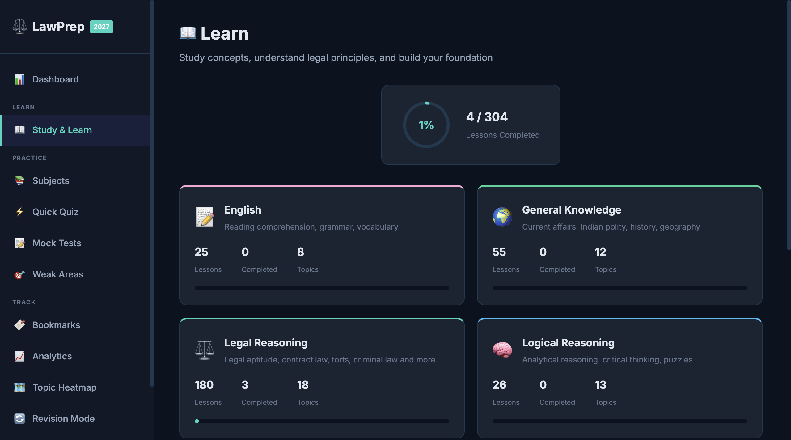
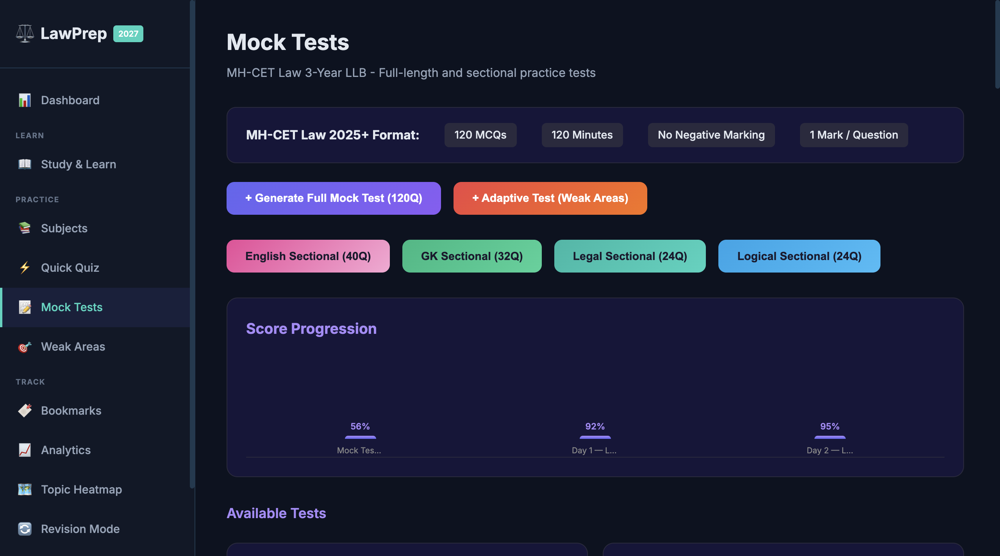
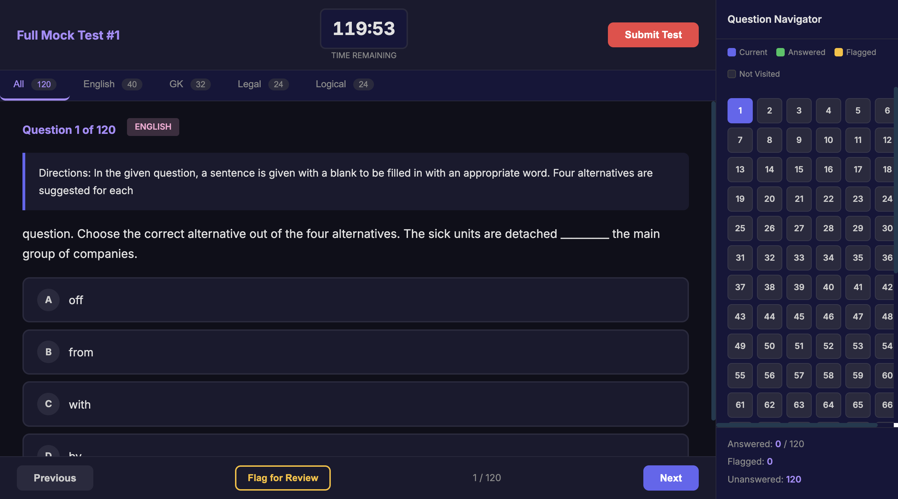
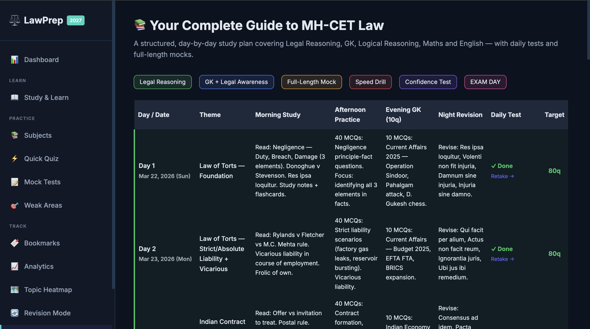
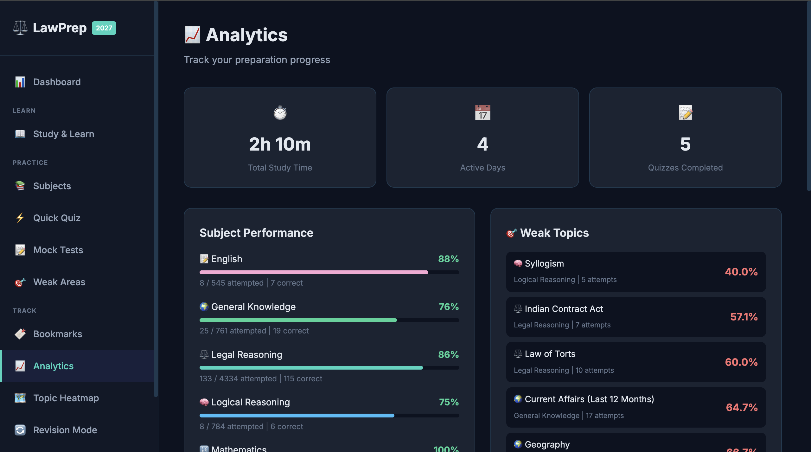

# LawPrep — MH-CET Law 2027 Study Portal

A free, open-source, fully-local study portal for the **MH-CET Law 2027** (3-Year LLB) entrance exam. Built for LLB aspirants by a fellow student.

Runs entirely on your own computer. No accounts, no ads, no data leaves your machine.

---

## Screenshots

| | |
| :--: | :--: |
| **Dashboard** | **Subjects** |
|  |  |
| **Lesson view** | **Mock tests** |
|  |  |
| **Full-length mock** | **Study plan** |
|  |  |
| **Analytics & progress** | |
|  | |

---

## What's inside

- **Structured lessons** for all five sections — Legal Reasoning, Logical Reasoning, English, Mathematics, and General Knowledge.
- **Thousands of practice MCQs** with detailed solutions, taken from previous years and curated question banks.
- **Full-length mock tests** with score breakdown, time tracking, and topic-wise analytics.
- **Complete study plan** — a structured, day-by-day prep schedule covering every section, with daily tests and full-length mocks built in.
- **Bookmarks, revision lists, and a progress heatmap** so you can see exactly where you stand.
- **Optional AI tutor** — paste your own Gemini / Claude API key to unlock on-demand explanations and lesson takeaways. The portal works fully without these.
- **Optional voice narration** of lessons via ElevenLabs TTS, with a free browser-based fallback.

The portal ships with a pre-built SQLite database (`lawprep.db`, ~5 MB) so you can start studying immediately after install — no data import required. The database arrives clean: no pre-existing progress, scores, or bookmarks. Every student starts from zero.

---

## Quick start (3 steps)

```bash
git clone https://github.com/MysticVoyager/lawprep.git
cd lawprep
./start.sh
```

Then open <http://127.0.0.1:5050> in your browser. That's it.

If `./start.sh` doesn't work for you (Windows, or a fussy shell), see [Manual install](#manual-install) below.

---

## Prerequisites

- **Python 3.10 or newer.** Check with `python3 --version`.
- A modern browser (Chrome, Firefox, Safari, Edge).
- Roughly **50 MB free disk space**.

That's all you need to run the core portal. The AI and TTS features are optional and explained below.

---

## Manual install

If the quick-start script doesn't suit your setup:

```bash
# 1. Clone the repo
git clone https://github.com/MysticVoyager/lawprep.git
cd lawprep

# 2. Create and activate a virtual environment (recommended)
python3 -m venv venv
source venv/bin/activate            # macOS / Linux
# venv\Scripts\activate             # Windows PowerShell

# 3. Install Python dependencies
pip install -r requirements.txt

# 4. (Optional) Copy the env template and add any API keys you have
cp .env.example .env
#    Then edit .env in your favourite editor.

# 5. Run the portal
python app/app.py
```

Open <http://127.0.0.1:5050> and you're in.

---

## Optional: enabling AI features

The portal is fully usable without any API keys. If you want the AI tutor, auto-generated lesson takeaways, or premium voice narration, add the relevant keys to your `.env` file.

| Feature | What it does | Where to get the key |
| --- | --- | --- |
| **Gemini tutor & lesson AI** | On-demand explanations, auto-generated takeaways and practice quizzes | <https://aistudio.google.com/app/apikey> (free tier available) |
| **Claude paragraph tutor** | "Explain this paragraph" button inside lessons — streams a Claude Haiku explanation | <https://console.anthropic.com/settings/keys> |
| **ElevenLabs TTS** | High-quality voice narration of lesson text | <https://elevenlabs.io/app/settings/api-keys> (free tier available) |

After editing `.env`, restart the portal for the keys to take effect.

> **Heads-up on costs.** Free tiers are usually enough for solo study. If you start using these heavily, watch your provider dashboards — you, not the portal, are billed for any usage.

---

## How to use it (recommended flow)

1. Open the dashboard and pick a subject from the sidebar.
2. Work through the **lessons** in order. Bookmark anything you want to revisit.
3. After every lesson, hit the **practice quiz** at the bottom.
4. Once you've covered a section, take a **mock test** for that subject.
5. Follow the **complete study plan** to stay on track across all five subjects right up to exam day.
6. Check the **heatmap** weekly to spot weak topics.

---

## Project structure

```
lawprep/
├── app/
│   ├── app.py              # Flask application (all routes)
│   ├── pdf_parser.py       # Optional: parses source PDFs into the DB
│   ├── lawprep.db          # Pre-built SQLite DB with lessons + questions
│   ├── templates/          # Jinja2 HTML templates
│   └── static/             # CSS, JS
├── docs/                   # Extra documentation
├── .env.example            # Template for API keys (copy to .env)
├── .gitignore
├── LICENSE
├── README.md
├── requirements.txt
└── start.sh                # One-command launcher
```

---

## Troubleshooting

**"command not found: python3"** — Install Python from <https://www.python.org/downloads/> (3.10+).

**"Address already in use" on port 5050** — Something else is using the port. Edit the last line of `app/app.py` and change `port=5050` to e.g. `port=5051`.

**`ModuleNotFoundError: No module named 'flask'`** — You forgot to activate the virtual environment, or you skipped `pip install -r requirements.txt`. Re-run step 3 of [Manual install](#manual-install).

**`pdfplumber` install fails on Windows** — You don't actually need `pdfplumber` to run the portal (the DB is pre-built). Comment it out of `requirements.txt` and re-run `pip install -r requirements.txt`.

**AI tutor button does nothing** — Open your browser's developer console. If you see a 503 from `/api/explain`, the relevant API key isn't set in `.env`. Add it and restart.

**"Database is locked"** — Close any extra Python processes running `app.py`, or any tool that has `lawprep.db` open (DB Browser for SQLite, etc.).

---

## Contributing

Pull requests are very welcome. Some easy ways to help:

- Spot a wrong answer in a question? Open an issue with the question text and the correct answer.
- Add new lesson content for a topic — see `docs/` for the JSON schemas used.
- Fix a bug, improve the UI, or add a missing keyboard shortcut.

Please don't commit any API keys, your local `.env`, or your personal `lawprep.db` if you've recorded private study progress on top of the shipped one.

---

## Disclaimer

This is an independent student project. It is **not affiliated with, endorsed by, or sponsored by** the State Common Entrance Test Cell, Government of Maharashtra, or any official exam body. Always cross-check important facts against official sources.

---

## License

MIT — see [LICENSE](LICENSE). Use it, fork it, share it, build on top of it. If it helps you crack the exam, drop a star on GitHub and pass the link to a junior. 🎓
